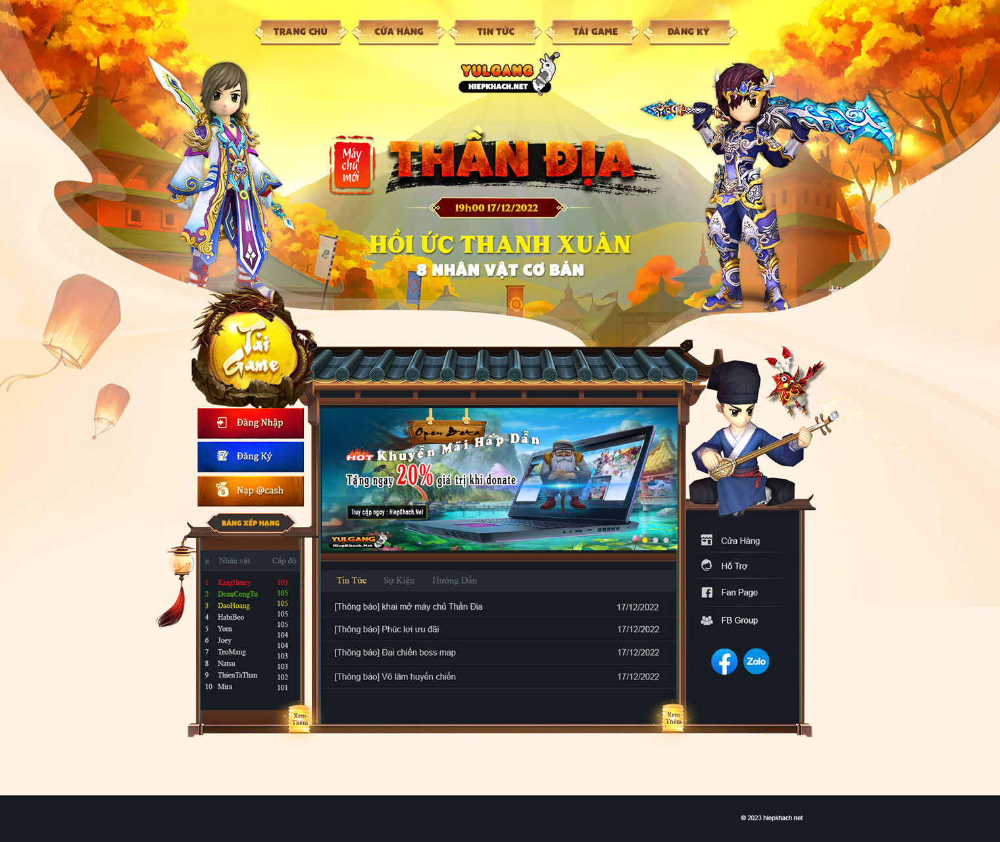

# Yulgang Website

## Giới thiệu

Yulgang là một trang web về game nhập vai trực tuyến nhiều người chơi (MMORPG) Yulgang, cũng được biết đến với tên gọi "Hiệp Khách Giang Hồ". Trang web cung cấp các thông tin, hướng dẫn, tin tức và diễn đàn dành cho cộng đồng người chơi Yulgang.

## Tính năng

- **Trang Chủ**: Cập nhật các tin tức và sự kiện mới nhất.
- **Cửa Hàng**: Bán các vật phẩm trong game, từ trang bị, trang phục đến các vật phẩm hỗ trợ khác.
- **Đăng ký**
- **Đăng nhập**

## Hướng dẫn cài dặt
- Bạn phải có Database Yulgang cài sẵn.
- Chỉnh sửa connect trong /include/conn.php

## Thông Tin Khác

### Yêu Cầu Hệ Thống

- **Hệ Điều Hành**: Windows 7/8/10/11, Windows Server 2012 hoặc mới hơn
- **MsSQL Server: 2012 hoặc mới hơn. Cần có Driver SQL Server Native Client 11.0 trở lên.
- **Web Server: Xampp (tùy chọn) 

### Hỗ Trợ

- Không hỗ trợ.
- Không chịu bất kỳ trách nhiệm nào đối với việc bạn sử dụng website này mà phát sinh lỗi, mất dữ liệu... 

## Bản Quyền

&copy; [minhthanhonly](https://www.facebook.com/thanhonly). MIT License.
